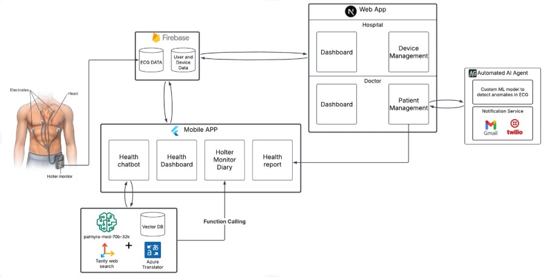
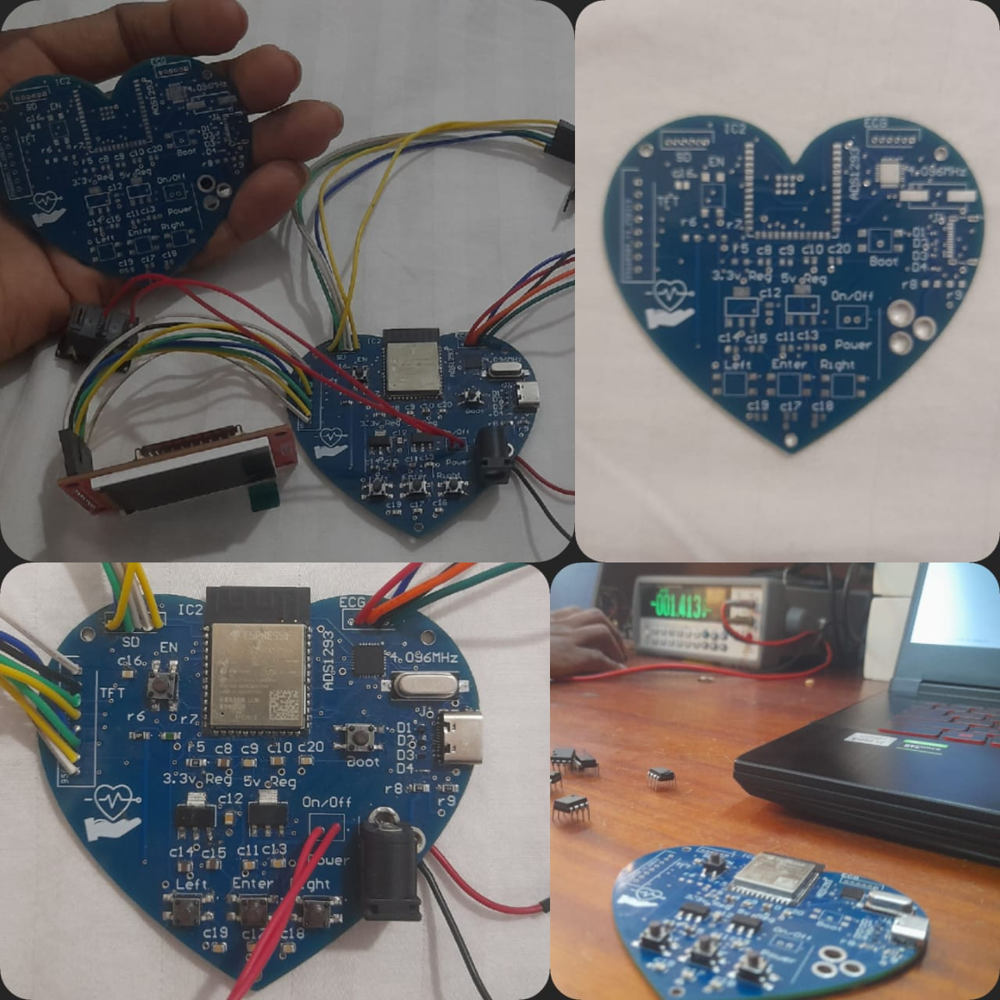
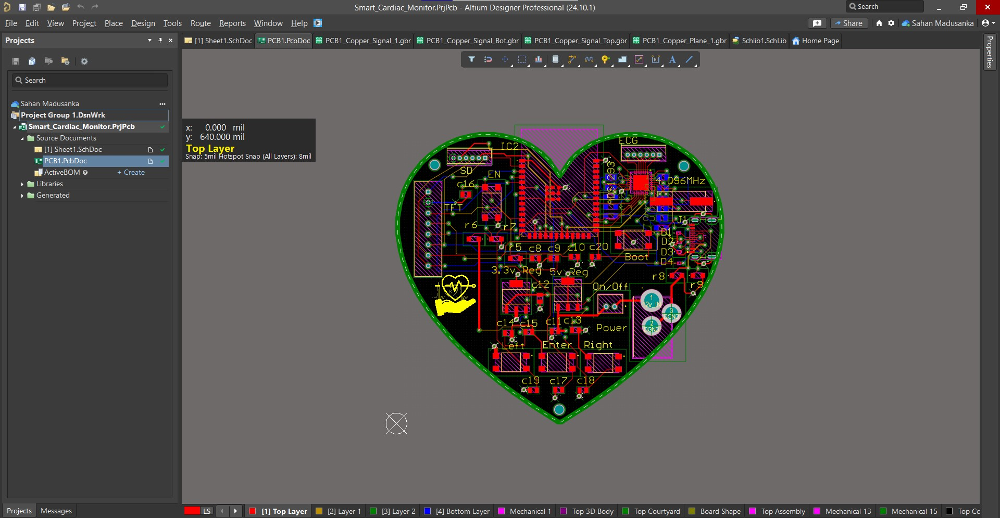
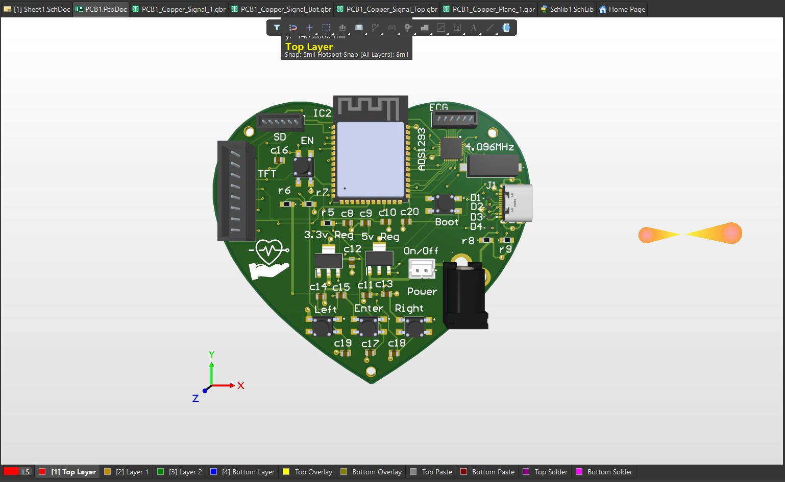
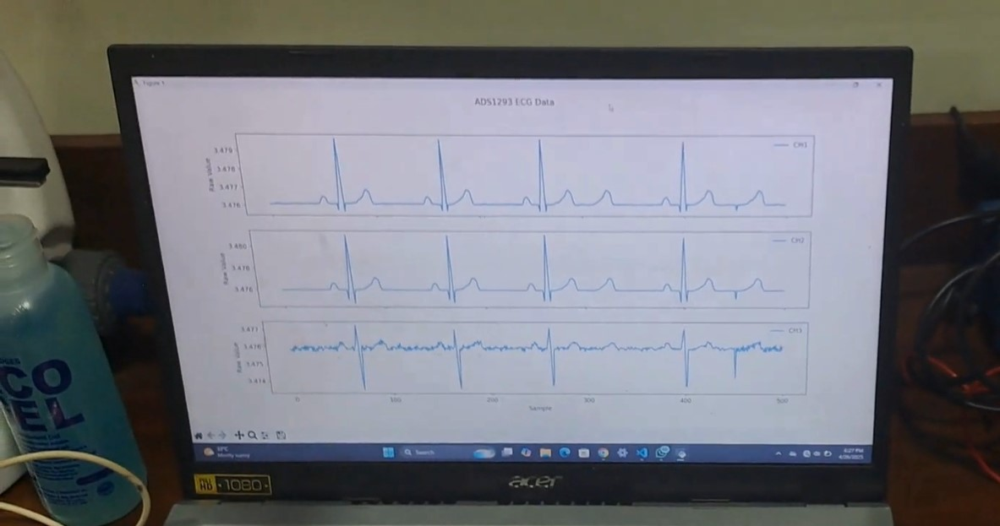
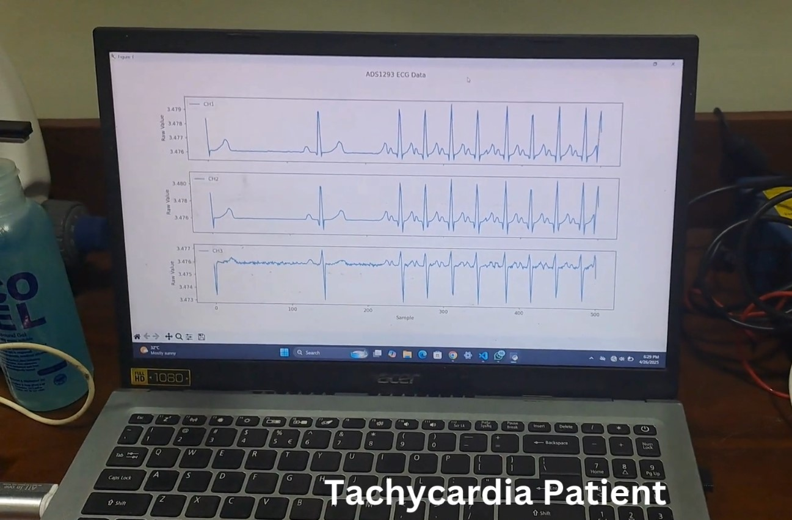
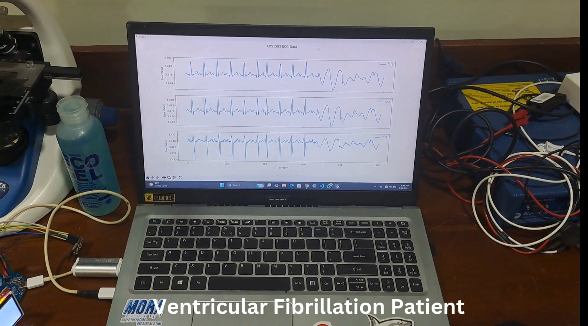
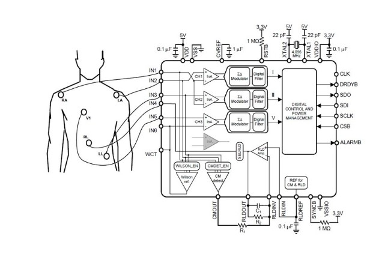
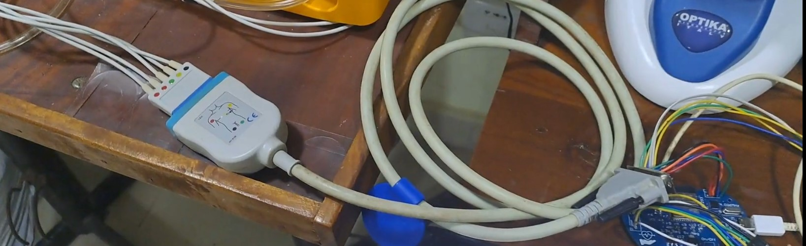
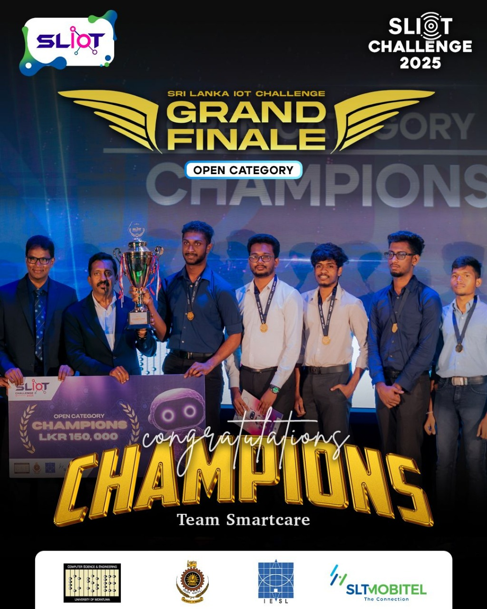

# SmartCare - Cardiac Ecosystem

**SmartCare** is a comprehensive cardiac Holter monitoring platform that includes:
- ⚙️ A 4-layer precision ECG acquisition PCB
- 🩺 **3-lead, 5-electrode, medical-grade ECG acquisition system**
- 📱 A mobile app for patients  
- 💻 A web dashboard for healthcare providers  
- 🖼️ A user-friendly enclosure (still under development using SolidWorks)  
- 🧠 LSTM-enhanced anomaly detection  

Together, they support advanced ECG monitoring, AI-assisted diagnosis, and secure health data management.

---

## 🖥️ System Overview

> The complete SmartCare system in action:

---

## 📸 Project Gallery

<table>
  <tr>
    <th>PCB Views</th>
    <th>ECG Signal Snapshots</th>
    <th>Accessories</th>
  </tr>
  <tr>
    <td>
      
<strong>Real PCB Photo</strong>

        
      
<strong>Altium Designer Layout</strong>

        
      
<strong>3D Rendered View</strong>

      
    </td>
    <td>
      
<strong>Normal ECG</strong>

        
      
<strong>Trachycardia patient</strong>

        
      
<strong>Ventricaular Fibrilation</strong>

      
    </td>
    <td>
      
<strong>ADS1293 AFE (TI) Medical Graded</strong>

      
      
<strong>ECG Cable</strong>

      
      
<strong>Fluke Simulator</strong>

      
    </td>
  </tr>
</table>

---

## 🚀 Features

### 📱 Mobile Application (Patient)
- **Health Reports**: View and manage ECG and other health reports  
- **AI Chatbot**: Get instant health advice via integrated AI  
- **Doctor & Patient Details**: Access doctor info and manage profiles  
- **Notifications**: Alerts for new reports and doctor messages  
- **Secure Data**: End-to-end encryption for sensitive health data  

### 💻 Web Dashboard (Healthcare Providers)

#### 🏥 Hospital Dashboard
- Manage SmartCare Holter monitors  
- Assign devices to patients  

#### 🛠 Admin Panel
- Register hospitals and doctors  
- Configure overall system settings  

#### 🩺 Doctor Portal
- Manage patient lists  
- Assign and monitor devices  
- Generate detailed health reports  

#### 🤖 AI Assistance
- AI-generated report suggestions  
- ML-based anomaly detection in ECG data  

#### 👥 Patient Management
- Track patient health status  
- Review historical ECG and symptom records  
- Manage emergency contacts  

---

## 🏆 SLIOT 2025 – Open Category Winners

We are proud to announce that **SmartCare** won the **championship title at SLIOT 2025**, Sri Lanka's largest innovation and IoT competition.

🏅 **SLIOT** is one of the most prestigious innovation competitions in the country, showcasing groundbreaking student-led solutions that can impact society.

Our project was selected as the winner for its:
- Innovation in wearable healthcare monitoring  
- Seamless integration of AI for anomaly detection  
- Medical-grade data access for both patients and healthcare providers  

> 🏆 This win recognizes our team's dedication to creating meaningful, life-saving health technologies.

---
